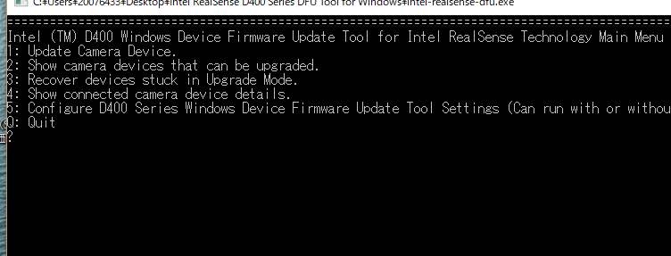
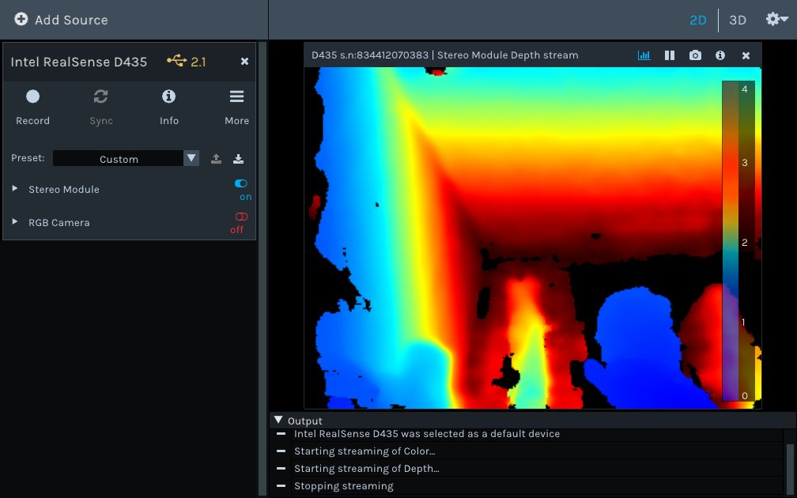

# D435 on Rabpian Strech with RaspberryPi-3 Model B+

[IntelR RealSense? D400 cameras with Raspberry Pi](https://github.com/IntelRealSense/librealsense/blob/master/doc/RaspberryPi3.md)  
[デプスカメラRealSenseD435で "紫色のイカ" や "オレンジ色の玉ねぎ" を切り取ったり "金髪の人" を追っかけて距離を測る（２） with RaspberryPi3 (Raspbian Stretch)](https://qiita.com/PINTO/items/2ad10526f9b2e1c8cdf3)  

### Break security holds,  
```
  $ git config --global http.sslVerify false
  $ vi  ~/.pip/pip.conf
    [global]
    trusted-host = pypi.python.org
                   pypi.org
                   files.pythonhosted.org
```

### Bringup linux environment

Write SDCard and boot  
- Use 2018-10-09-raspbian-stretch.img  

- touch /boot/ssh  
booting 

- Hold kernel and upgrade  
Mark any linux-image as hold and upgrade  

```
$ uname -r
4.14.71+

# apt-cache showpkg linux-image

# apt-mark hold raspberrypi-kernel
# apt-mark hold linux-image-3.6-trunk-rpi
# apt-mark hold linux-image-3.10-3-rpi

# apt update
# apt upgrade
# reboot

$ uname -r
4.14.71-v7+
```

```
 # apt install -y libxml2-dev libxslt1-dev
 # pip3 install pillow lxml  matplotlib cython

 # apt install -y libgtkglext1 libgtkglext1-dev
 # apt-get install build-essential freeglut3-dev python-opengl

 # apt install -y git libssl-dev libusb-1.0-0-dev pkg-config libgtk-3-dev
 # apt install -y libglfw3-dev at-spi2-core libdrm* python-tk libjpeg-dev libtiff5-dev
 # apt install -y libjasper-dev libpng12-dev libavcodec-dev libavformat-dev
 # apt install -y libswscale-dev libv4l-dev libxvidcore-dev libx264-dev qt4-dev-tools
 # apt install -y autoconf automake libtool curl libatlas-base-dev mesa-utils* 
 # apt install -y libglu1* libgles2-mesa-dev libopenal-dev cmake-curses-gui
 # apt update 
 # apt upgrade

```

**Notice: Needs up to GCC 6***  

### Update cmake 3.11.4
```
$ cd ~
$ wget https://cmake.org/files/v3.11/cmake-3.11.4.tar.gz
$ tar -zxvf cmake-3.11.4.tar.gz;rm cmake-3.11.4.tar.gz
$ cd cmake-3.11.4
$ ./configure --prefix=/home/<username>/cmake-3.11.4
$ make
$ make install
$ export PATH=/home/<username>/cmake-3.11.4/bin:$PATH
$ source ~/.bashrc
$ cmake --version
```

### Build OpenCV with TBB and OpenGL,  
```
  # apt install libavresample-dev libv4l-dev
  # apt install mesa-utils* libglu1* libgles2-mesa-dev

  $ wget -O opencv.zip https://github.com/Itseez/opencv/archive/3.4.1.zip
  $ unzip opencv.zip;rm opencv.zip
  $ wget -O opencv_contrib.zip https://github.com/Itseez/opencv_contrib/archive/3.4.1.zip
  $ unzip opencv_contrib.zip;rm opencv_contrib.zip
  $ cd ~/opencv-3.4.1/;mkdir build;cd build
  $ cmake -D CMAKE_CXX_FLAGS="-DTBB_USE_GCC_BUILTINS=1 -D__TBB_64BIT_ATOMICS=0" \
          -D CMAKE_BUILD_TYPE=RELEASE \
          -D CMAKE_INSTALL_PREFIX=/usr/local \
          -D INSTALL_PYTHON_EXAMPLES=OFF \
          -D OPENCV_EXTRA_MODULES_PATH=~/opencv_contrib-3.4.1/modules \
          -D BUILD_EXAMPLES=OFF \
          -D PYTHON_DEFAULT_EXECUTABLE=$(which python3) \
          -D INSTALL_PYTHON_EXAMPLES=OFF \
          -D BUILD_opencv_python2=ON \
          -D BUILD_opencv_python3=ON \
          -D WITH_OPENCL=OFF \
          -D WITH_OPENGL=ON \
          -D WITH_TBB=ON \
          -D BUILD_TBB=OFF \
          -D WITH_CUDA=OFF \
          -D ENABLE_NEON:BOOL=ON \
          -D WITH_QT=OFF \
          -D WITH_OPENGL=ON \
          -D BUILD_TESTS=OFF ..
  $ make -j1
  $ sudo make install
  $ sudo ldconfig

  $ python  -c "import cv2"
  $ python3 -c "import cv2"
```

### Build librealsense(v2.22.0),  
```
 $ git clone https://github.com/IntelRealSense/librealsense
 $ cd librealsense
 $ mk build ; cd build
 
 $ cmake .. -DBUILD_EXAMPLES=true -DCMAKE_BUILD_TYPE=Release
 $ make -j1
 # make install
 
 $ cmake .. -DBUILD_EXAMPLES=true -DBUILD_PYTHON_BINDINGS=bool:true -DPYTHON_EXECUTABLE=$(which python3)
 $ make -j1
 # make install
 $ export PYTHONPATH=$PYTHONPATH:/usr/local/lib

 $ python  -c "import pyreadsense2"
```

### Update firmware on Windows10
Download Intel RealSense D400 Series DFU Tool for Windows.zip and D400_Series_Production_FW_5_11_1_100.zip  
  

### Check realsense-viewer on RaspberryPi-3 Model B+
```
 $ ls /dev/video*
   /dev/video0  /dev/video1  /dev/video2

 $ realsense-viewer
 11/06 13:17:09,237 WARNING [1725944304] (types.cpp:48) Out of frame resources!
 11/06 13:17:09,237 ERROR [1725944304] (synthetic-stream.cpp:44) Exception was thrown during user processing callback!
 11/06 13:17:09,238 ERROR [1725944304] (synthetic-stream.cpp:44) Exception was thrown during user processing callback!
```
  

Ok  

# D435 on Armbian Strech with Rock64(USB3.0)  

- Download and write Armbian to SDCard  
[Armbian_5.75_Rock64_Debian_stretch_default_4.4.174_desktop](https://dl.armbian.com/rock64/archive/Armbian_5.75_Rock64_Debian_stretch_default_4.4.174_desktop.7z)

- Boot as root and check  
```
 # uname -r
   4.4.174-rockchip64
 # gcc --version
   gcc (Debian 6.3.0-18+deb9u1) 6.3.0 20170516
 # cmake --version
   cmake version 3.7.2
```

**Notice: Default id/pass are root/1234**  

- Upgrade distribution  
```
 # apt update && apt upgrade -y  
```

**Continue from above "Break security holds" section**  

# D435 on Ubuntu 16.04 server with Altera Arria10soc  

- Upgrade GCC version 5 to version 6 via [PPA](https://launchpad.net/~ubuntu-toolchain-r/+archive/ubuntu/test).  

```
 # uname -r
   4.9.78-ltsi-06726-g5704788
 # apt-get update
 # apt-get install build-essential software-properties-common -y
 # add-apt-repository ppa:ubuntu-toolchain-r/test -y
 # apt-get update
 # apt-get install gcc-6 g++-6 -y
 # update-alternatives --install /usr/bin/gcc gcc /usr/bin/gcc-6 60 --slave /usr/bin/g++ g++ /usr/bin/g++-6
 # gcc --version
   gcc (Ubuntu/Linaro 6.5.0-2ubuntu1~16.04) 6.5.0 20181026
```

**Continue from above "Break security holds" section**  

**Jun.28, 2019**  
